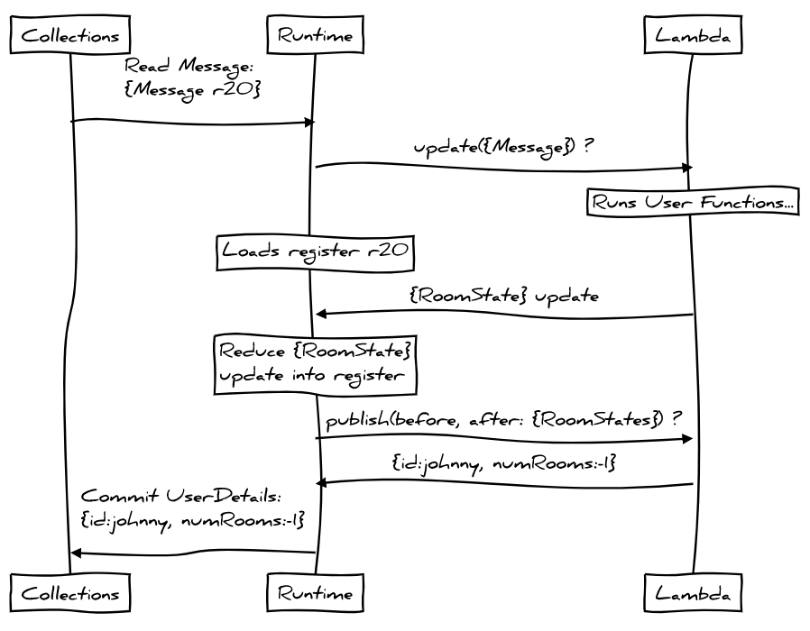
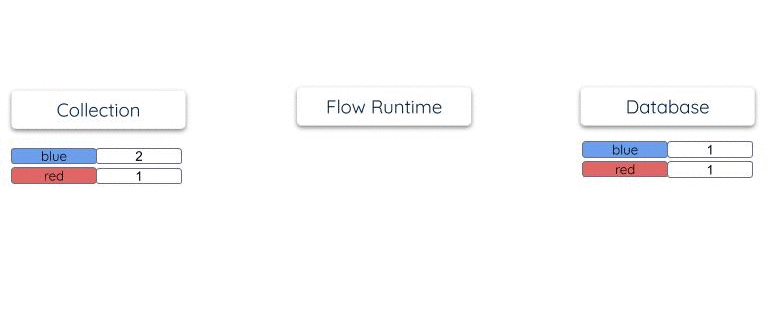

# Filling a Paradigm-Shaped Hole

👋 Hi, I'm Johnny, I work at [Estuary](https://estuary.dev) on our product
[Flow](https://github.com/estuary/flow).
Flow is a GitOps tool for integrating all of the systems
you use to produce, process, and consume data.
Today I'll talk about how Flow can help you maintain
complex materialized views in your database(s) of choice.

## The Shape of a Problem

This post is a response to Liron Shapira's [Data Denormalization is Broken][1].
Liron details the subtleties of a "simple" messaging application that models
messages and user-to-room subscriptions.
This hypothetical app needs an indexed view for fast loads and good user experience,
but Liron laments the difficulty of actually _maintaining_ a view like this.
He concludes (emphasis mine):

> Right now, working with denormalized data is **bad**. If you’ve ever written
> anything less than the perfect denormalized-field recomputation code,
> then running it will have introduced data corruptions. Just like that,
> you’ve silently nuked the logical invariant that you were hoping to maintain
> on your data set. Don’t you wish that were impossible? Our current approach
> to denormalization has a **paradigm-shaped hole**.

[1]: https://lironshapira.medium.com/data-denormalization-is-broken-7b697352f405

What we're after today - as posed by Liron - is a materialized view
which serves up each user's number of unread chat rooms.
It must account for:

- Messages being sent by users, and other users viewing them.
- Messages being deleted without being read by some or all users.
- Users deleting room subscriptions which may or may not have unread messages.
- Users _un_-seeing chat rooms by restoring an older `seenTimestamp`.
- Message timestamps changing, perhaps due to an edit.

Amazingly, all of these update paths stem from just two "toy" inputs:
Messages and RoomUser subscriptions!
The trouble is that most databases don't
support incremental materializations,
and we're _deeply_ out of luck if we want it live elsewhere,
perhaps in Redis or DynamoDB.

Without better options we'll often bury view-update logic inside application event handlers,
but this gets unwieldy _quickly_ given the number of update paths.
And to anyone who's achieved fault tolerant, correct, exactly-once increments
of a secondary Redis index in concert with their primary database transaction
as _application logic_:
I'm both impressed and sympathetic to your suffering.

We're building Flow to make this better.
What I'll demonstrate is how Flow can de-structure this
problem into simpler parts that are isolated from our application logic.
Flow can test the resulting workflow,
and can run it to maintain an always-fresh index
as a regular PostgreSQL table.

Let's see it in action.

## Demo Time

_This post lives in
[a Git repository](https://github.com/jgraettinger/blog).
You can open it in
[VSCode Remote Containers](https://marketplace.visualstudio.com/items?itemName=ms-vscode-remote.remote-containers)
or
[GitHub CodeSpaces](https://github.com/features/codespaces)
(early access) and run the console commands yourself._

We'll start with basic Flow
[collections](https://docs.estuary.dev/concepts/catalog-entities/collections)
for Messages and RoomUsers:

```yaml
collections:
  messages:
    key: [/id]
    schema: messages.schema.yaml

  roomUsers:
    key: [/roomId, /userId]
    schema: roomUsers.schema.yaml
```

Our desired view is implemented as a
[derived collection](https://docs.estuary.dev/concepts/catalog-entities/derivations).
We'll look at it a bit later.
First start a local development instance of Flow:

```console
$ flowctl develop --source userDetailsView.flow.yaml
```

Then ingest the examples from Liron's post:

```console
$ curl -f -H 'Content-Type: application/json' -d @/dev/stdin http://localhost:8080/ingest <<EOF
{
    "messages": [
        {
            "id": "m94",
            "roomId": "r31",
            "senderId": "sasha-rosse",
            "timestamp": 1483,
            "content": "Perfect!"
        },
        {
            "id": "m75",
            "roomId": "r20",
            "senderId": "mac-tyler",
            "timestamp": 1359,
            "content": "I have a great idea..."
        },
        {
            "id": "m87",
            "roomId": "r20",
            "senderId": "mac-tyler",
            "timestamp": 1372,
            "content": "Let's go see Giraffage tonight!"
        }
    ],
    "roomUsers": [
        {
            "roomId": "r31",
            "userId": "liron-shapira",
            "seenTimestamp": 1310
        },
        {
            "roomId": "r20",
            "userId": "liron-shapira",
            "seenTimestamp": 1308
        }
    ]
}
EOF
```

As expected user `liron-shapira` now has two unread rooms:

```console
$ psql -h localhost -c 'SELECT id, numUnreadRooms FROM user_details;'
      id       | numunreadrooms
---------------+----------------
 liron-shapira |              2
(1 row)
```

`flowctl develop` created this table for us upon its startup,
using a declared
[materialization](https://docs.estuary.dev/concepts/catalog-entities/materialization)
and JSON schema.
It's a regular table and indexed on user ID for efficient lookups:

```console
$ psql -h localhost -c '\d user_details;'
               Table "public.user_details"
     Column     |  Type  | Collation | Nullable | Default
----------------+--------+-----------+----------+---------
 id             | text   |           | not null |
 name           | text   |           |          |
 numunreadrooms | bigint |           |          |
 flow_document  | json   |           | not null |
Indexes:
    "user_details_pkey" PRIMARY KEY, btree (id)
```

Suppose Liron sees Sasha's latest message, and Mac's first message but not their second.
Liron has seen all of room `r31`,
but `r20` has one remaining message:

```console
$ curl -f -H 'Content-Type: application/json' -d @/dev/stdin http://localhost:8080/ingest <<EOF
{
    "roomUsers": [
        {
            "roomId": "r31",
            "userId": "liron-shapira",
            "seenTimestamp": 1510
        },
        {
            "roomId": "r20",
            "userId": "liron-shapira",
            "seenTimestamp": 1365
        }
    ]
}
EOF
```

The view updates as we'd expect:

```console
$ psql -h localhost -c 'SELECT id, numUnreadRooms FROM user_details;' --tuples-only
 liron-shapira |              1
```

## Test

Rather than bore you with the remaining cases,
I'll point out that Flow offers built-in
[testing](https://docs.estuary.dev/concepts/catalog-entities/tests)
and you can run a suite to exercise them:

```console
$ flowctl test --source userDetailsView.flow.yaml
Running  6  tests...
✔️ userDetails.flow.yaml :: Deleting only unread messages decrements unread rooms
✔️ userDetails.flow.yaml :: Deleting rooms with read and unread messages
✔️ userDetails.flow.yaml :: Liron's example has two unread rooms
✔️ userDetails.flow.yaml :: New messages increment only fully-read rooms
✔️ userDetails.flow.yaml :: Updating message timestamp can update unread rooms
✔️ userDetails.flow.yaml :: Viewing rooms decrements unread rooms

Ran 6 tests, 6 passed, 0 failed
```

## An Implementation Sketch

Before throwing Flow concepts at you, I want to give a sketch
for how a view like this can work.
Suppose we maintain a RoomState data structure for a chat room with:

- Messages of the room and their associated timestamps.
- Subscribers of the room and when they last saw it.

We'd have something like this:

```json
{
  "messages": {
    "m102": 1532,
    "m94": 1483
  },
  "subscribers": [{ "userId": "liron-shapira", "seenTimestamp": 1510 }]
}
```

This is a useful structure: it tells us which subscribers have seen the room.
You take the latest timestamp of any message
and compare to the `seenTimestamp` of each subscriber.

We have many rooms, so we'll need a bunch of RoomStates in a fast index somewhere.
Each time a Message or RoomUser arrives, we'll inspect its `/roomId` and
look up the corresponding RoomState in our index.

Each Message that arrives requires that we update the RoomState:
either to track a new message sent to the room,
or because a message changed its timestamp, or was deleted.
That's easy: we just upsert or remove into `/messages` keyed on the message ID.
Whenever a RoomUser arrives we mutate `/subscribers` in a similar way.

Let's decouple this a bit further: we'll define a _mapping_ from any
single Message or RoomUser into a RoomState, and a _reducer_ which
takes two RoomStates and deeply merges them.

See what just happened?
Before we had many code paths - one for each flavor of input -
that _each_ figured out how to incrementally update a RoomState - _ugh!_
Now we have trivial functions that map their input _into_ a RoomState.
Plus one reducer function that smashes those RoomStates together,
which frankly sounds kind of hard 🤔.
At least the pure functions are a piece of cake!

Anyway suppose we compare the _before_ and _after_ copies of an updated RoomState.
Hey, this is useful too!
Since one RoomState tells us users that have seen the room,
comparing RoomStates tell us which users _toggled_ between having seen the room:

```json
// Compare this RoomState as *after* to the RoomState from before:
{
  "messages": {
    // "m102": 1532, // Deleted.
    "m94": 1483
  },
  "subscribers": [
    { "userId": "liron-shapira", "seenTimestamp": 1510 },
    { "userId": "johnny", "seenTimestamp": 0 } // Added.
  ]
}

// "liron-shapira": "not seen" (1532 > 1510 is true) =>
//                  "seen" (1483 > 1510 is false).
// "johnny":        "seen" (implicit) =>
//                  "not seen" (1483 > 0 is true).
```

Let's track each of these toggles as a `-1` or `+1` increment to the user's `numUnreadRooms`.
Now all we have to do is keep a running sum for each user somewhere... how about in a PostgreSQL table?

## This is Just Map/Reduce

This formulation is one of many possible.
Arguably it's not even a very good one,
but I'll leave improvements as an exercise for you.

If you crack open a database query planner,
this is what its gooey center looks like — though perhaps a bit
more inscrutable and less tuneable.
Databases use internal states like RoomState all the time,
as an internal result set
built in service of the result that you _actually_ asked for.

What's salient here is that we've deconstructed the hard question of
"how should a Message or RoomUser update user's `numUnreadRooms`?"
into a bunch of simpler questions:

- **(A)** How should a Message or RoomUser be shuffled to its current RoomState?
- **(B)** How do I turn that Message or RoomUser into a RoomState?
- **(C)** Given a current RoomState,
  how do I reduce an update to produce a next state?
- **(D)** Given previous and next RoomSates,
  which users toggled between having seen the room?
- **(E)** Given the set of toggles of each user,
  what's their current `numUnreadRooms`?

_Lots_ of problems can be tackled by this kind of destructuring
and the general shapes tend to be really similar:

- Shuffling a document on an extracted key
- Mapping a document into another kind of document
- Combining or reducing multiple documents into one
- Mapping a document, as well as _before_ and _after_ internal states, into other documents
- Recursively shuffling, mapping, or reducing _those_ documents in further, cascaded steps

## Flow As Continuous Map/Reduce

Flow lets you express map/reduce workflows in declarative terms: a
[catalog](https://docs.estuary.dev/concepts/catalog-entities)
of YAML definitions and associated pure-function lambdas.
You _apply_ a catalog to the Flow runtime.
It then executes it continuously, at any scale, driven by your writes,
with end-to-end "exactly once" semantics.

Catalog specifications are succinct but don't sacrifice fidelity
to the various shapes these kinds of workflows can take
— as simple as possible but no simpler.

If you're familiar with traditional database architecture,
you'll notice a bit of a theme:
internal database details are often front-and-center concepts within Flow.
This is of a piece with Flow's broader vision of
[un-bundling the database](https://www.confluent.io/blog/turning-the-database-inside-out-with-apache-samza/)
— without forsaking the properties that make databases desirable in the first place!

Internal states are no exception.
Flow calls these
[registers](https://docs.estuary.dev/concepts/catalog-entities/derivations#registers):
keyed documents used for indexed states like RoomState.
Registers enable the full gamut of stateful streaming workflows,
including joins and aggregations.
They're fast, durable,
and avoid the windowing and scaling limitations
that plague other stateful stream architectures.

Writing reducers can be verbose and error-prone, so with Flow **you don't write them**.
Instead you annotate JSON schemas with
[`reduce` annotations](https://docs.estuary.dev/reference/catalog-reference/schemas-and-data-reductions#reductions)
that tell Flow how to combine documents having the same key.
This is another inversion from a database:
SQL functions like `SUM` imply reduction under the hood,
but Flow hoists reduction to a top-level schema concern.

In fact, of **(A-E)** above only **(B)** and **(D)** require any code:
You provide Flow with pure functions that map documents into other
documents.

Flow supports TypeScript modules,
which Flow runs on your behalf,
or a JSON HTTP endpoint that you supply.
In the future we'll add support for WebAssembly and OpenAPI.

---

Putting it all together, here's a
derived collection and
[schema](https://github.com/jgraettinger/filling-paradigm-shaped-hole/blob/master/userDetails.schema.yaml):

```yaml
collections:
  userDetails:
    key: [/id]
    schema: userDetails.schema.yaml

    derivation:
      register:
        schema: userDetails.schema.yaml#/$defs/roomState
        # A room initializes with no subscribers or messages.
        initial: { subscribers: [], messages: {} }

      transform:
        fromMessages:
          source: { name: messages }
          shuffle: { key: [/roomId] }
          update: { lambda: typescript }
          publish: { lambda: typescript }

        fromRoomUsers:
          source: { name: roomUsers }
          shuffle: { key: [/roomId] }
          update: { lambda: typescript }
          publish: { lambda: typescript }
```

And here's the basic workflow that Flow runs:


<!--
Build with markdown preview enhanced:
```sequence {theme="hand"}
Collections->Runtime: Read Message:\n{Message r20}
Runtime->Lambda: update({Message}) ?
Note over Lambda: Runs User Functions...
Note over Runtime: Loads register r20
Lambda->Runtime: {RoomState} update
Note over Runtime: Reduce {RoomState}\nupdate into register
Runtime->Lambda: publish(before, after: {RoomStates}) ?
Lambda->Runtime: {id:johnny, numRooms:-1}
Runtime->Collections: Commit UserDetails:\n{id:johnny, numRooms:-1}
```
-->

1. The derivation shuffles each Message or RoomUser to a corresponding
   RoomState register on `/roomId`.

2. It calls an `update`
   [TypeScript lambda](https://github.com/jgraettinger/filling-paradigm-shaped-hole/blob/master/userDetails.flow.ts)
   to map the source document into a RoomState.

3. It uses `reduce` schema annotations to fold the update into the current register.

4. It calls the `publish` lambda with _before_ and _after_ versions of the RoomState
   (and also the source document, which we don't need here).

5. The lambda identifies users who have toggled between rooms,
   and returns documents like `{"id":"johnny","numUnseenRooms":"-1"}`.

6. Returned documents are checked against the collection schema,
   they're grouped and combined on user `/id` (the collection key),
   and they're committed to the collection.

Finally `userDetails` is materialized to a table:

```yaml
materializations:
  - endpoint:
      name: demo/database
      config: { table: user_details }
    source: { name: userDetails }
```

Materializations are always in terms of the collection's key
and they use only the storage provided by the database itself
(without keeping another internal copy).
The schema annotates that `numUnreadRooms` is to be summed,
so Flow maintains the running lifetime tally directly in the table
by reading, combining, and storing documents:



## How this Helps

What we've achieved is a de-normalized view, in our database of choice,
that's reactive to our normalized business events (past and future).
It's consolidated into a single place, strongly-typed, tested,
and fully isolated from our application code.
Flow will manage its execution for us and we don't have yet another app to deploy.

The solution isn't _completely_ declarative —
we've still written a non-trivial function to identify
users that changed between room states —
but it's a lot simpler than the spaghetti of updates in application handlers.

From here we'll be able to evolve the derivation over time,
or add a materialization into another system
(perhaps we'll want a key/value store).
We could even compose it as an input of yet-another derivation.

## On Query Planners

It's not entirely lost on me that Liron asked for easy de-normalized views
and I've offered up a moderately complex continuous map/reduce workflow.

Why not, for example, apply a query planner that turns a higher-level
language like SQL into an _internal execution plan_ using something
like derivations and registers?

The short answer is that a query-planner _first_ approach is
incompatible with Flow's broader objective of
being your tool of choice for building production data products.

This is because:

- Flow derivations allow for bringing your own code:
  run TypeScript, remote lambdas, and (in the future) WebAssembly.
  It's unclear how that flexibility
  could be incorporated into query plans.

- There isn't a query language I'm aware of, including SQL,
  that's good at representing the temporal dynamics of stream-to-stream joins.
  Imagine you have a stream of products and customer orders.
  You express a simple SQL query that joins orders against product
  listings to arrive at an order price.

  Okay, but... _which_ price ? The price right now,
  or as it was at the time of the order?
  Probably the latter, right?
  But how do you express that in SQL again?

- You'll need to evolve workflows over time —
  joining in a new data set,
  enriching with extra fields, or fixing a bug —
  and you may want to do it on a go-forward basis
  without disrupting downstream use cases.
  Derivations allow for such changes today,
  but it's unclear how a planner could.

- The details of a query plan really matter,
  particularly when they're part of a production service
  run at scale for months or years.
  Your whole team should understand the plan's operational aspects,
  and planners often get in the way of an engineer who knows what they want.

In truth this stuff is _hard_ and trade-offs abound.
Flow threads the needle today by exposing its fundamental
operations as first-class primitives,
with the hope and expectation that, in the future,
one or more query planners could be
layered on to generate execution graphs _in terms_ of these
primitives — an area we'll explore going forward.
If you'd like to explore with us, we'd love to talk!

## What's next?

Our road map for Flow includes more endpoints for materializations,
captures, WebAssembly support, more powerful schema annotations
(including user-defined reductions powered by WebAssembly!),
computed shuffles, and more.
There's lots to do, and we'd love for you to get involved.

Please check out
[our docs](https://docs.estuary.dev)
or
[Flow's git repo](https://github.com/estuary/flow),
start a discussion on GitHub or join our
[Slack](https://join.slack.com/t/gazette-dev/shared_invite/enQtNjQxMzgyNTEzNzk1LTU0ZjZlZmY5ODdkOTEzZDQzZWU5OTk3ZTgyNjY1ZDE1M2U1ZTViMWQxMThiMjU1N2MwOTlhMmVjYjEzMjEwMGQ)!
